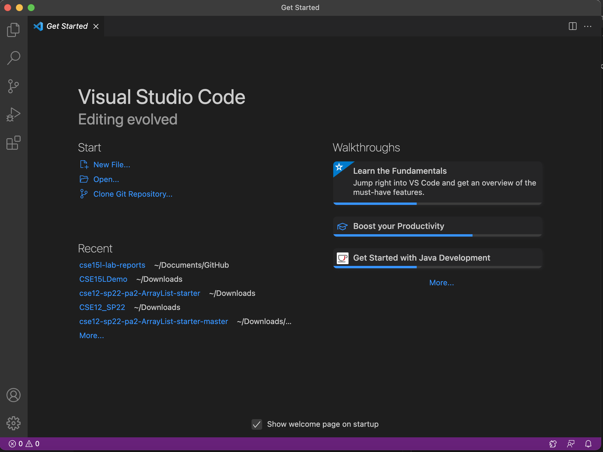
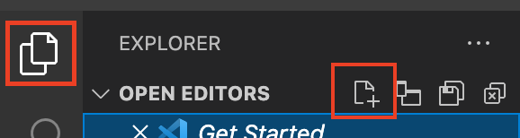
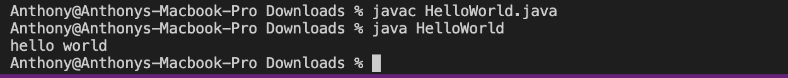
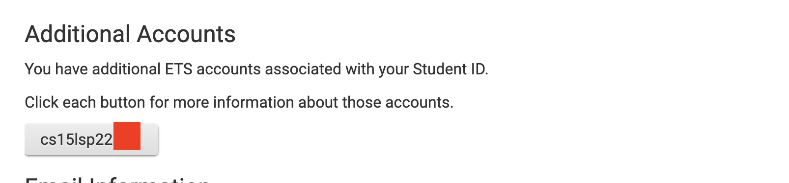
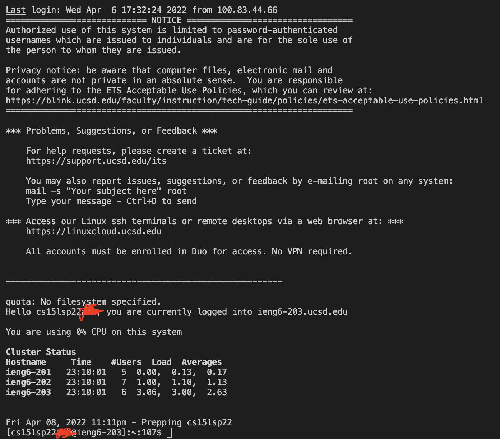
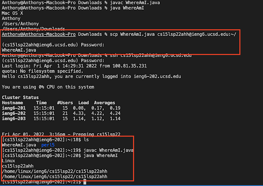

# **Report 1 (Week 1-2) - Remote Access**
In this post, you will learn how to remotely access your course-specific account on the `ieng6` server.

## **Part 1** - Setting up VSCode and Running A File
**Step 1:** Download and install [VSCode](https://code.visualstudio.com/download). Make sure to download the correct one for your operating system.

Once you have downloaded VSCode and opened it, it should look something like this.


**Step 2:** Click on the file icon at the top left corner, then click on the file icon with a plus sign next to "OPEN EDITORS".


Copy and paste the following code in after you open a new file:

```
class WhereAmI {
  public static void main(String[] args)
  {
    System.out.println(System.getProperty("os.name"));
    System.out.println(System.getProperty("user.name"));
    System.out.println(System.getProperty("user.home"));
    System.out.println(System.getProperty("user.dir"));
  }
}

```

Then go to `File` at the top left corner and save the file to your computer, name it as `WhereAmI.java`.

**Step 3:** Press CTRL + ` (the key with the "~" symbol) to open the terminal.

In the terminal, run these commands:

`javac WhereAmI.java`

`java WhereAmi`

Then you should see the terminal print out some stuff about your computer and the current directory in your terminal.


## **Part 2** - Remotely Connecting To `ieng6`

\*\*Do Step 0 if you are using Windows, otherwise skip it\*\* <br>
**Step 0:** Follow the directions [here](https://docs.microsoft.com/en-us/windows-server/administration/openssh/openssh_install_firstuse) to install OpenSSH

**Step 1:** Look up your course-specific account [here](https://sdacs.ucsd.edu/~icc/index.php). Under `Account Lookup`, put in your PID (AXXXXXXXX) and username (\<username\>@ucsd.edu) and click submit. 

Under `Additional Accounts`, you will see your course-specific account(s). The account should be the course name, followed by the current quarter, then 3 random letters.

<font size = "1">*An account for CSE15L in Spring '22* </font>

**Step 2:** Go back to your terminal in VSCode. In the terminal, type in the following command:

`ssh <account-username>@ieng6.ucsd.edu`

\<account-username\> is the name of your course-specific account that you looked up in the previous step.

Press enter after you enter the command. If it's your first time connecting to the `ieng6` server, the terminal will ask something about the "authenticity of host 'ieng6.ucsd.edu'" and whether you want to continue connecting, enter 'yes' or whatever option they give for continuing.

After typing 'yes', enter your password when the terminal prompts you to. Then you should be logged in.

**Note:** your password will not show up as dots like you would normally see on other websites, so type your password as accurately as you can, then hit 'enter' after you have put in your password.

If you don't know your password, follow this [guide](https://cdn-uploads.piazza.com/paste/ktv2gnof3sx5bf/181c3cb053df5cf1ccaf0457f56f12a2e5aa90b139aef8c2ea8fcc590f02fadf/How-to-Reset-your-Password.pdf) to reset your password.

After logging in, then your terminal will look something like this:


Congratulations, your computer is now connected to one of the computers in the CSE basement!

## **Part 3** - Running Commands
Try running any of the following commands and see what they do:

`ls`<br>
`pwd`<br>
`cd`<br>
`cd ~`<br>
`cd ..`

To log out of SSH, type 'exit'.

## **Part 4** - Moving Files With `scp`

`scp` stands for Secure Copy. `scp` is a way to securely copy and transfer files between two computers. In this case, from your computer to the computer in the CSE basement, vice versa. The computer that you're typing `scp` on will be the computer with the file that will be copied and transferred; you will specify to which computer you want to transfer the file to in the command-line.

Using the `WhereAmI.java` file we created earlier, we will copy and transfer it to your `ieng6` account.

Type in the following (make sure you log out of `ieng6` first):

`scp HelloWorld.java <account-username>@ieng6.ucsd.edu:~/`

The terminal will prompt you for a password. The password is the same one that you used to log into the `ieng6` server earlier. After entering the password, the file should then be copied and transferred to your account on the `ieng6` server.

Log back into your `ieng6` account and run `ls` to confirm that the file has been successfully transferred. Then run `javac WhereAmI.java` and `java WhereAmI` while logged into the `ieng6` account and check your output. See what's different from when you run it in your computer!

This entire process should look something like this:



Now you have successfully copied and transferred a file over to a remote computer from your own computer!
## **Part 5** - SSH Keygen


