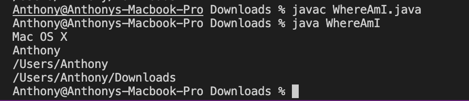

# **Report 1 (Week 1-2) - Remote Access**
In this post, you will learn how to remotely access your course-specific account on the `ieng6` server.

## **Part 1** - Setting up VSCode and Running A File
**Step 1:** Download and install [VSCode](https://code.visualstudio.com/download). Make sure to download the correct one for your operating system.

Once you have downloaded VSCode and opened it, it should look something like this.


**Step 2:** Click on the file icon at the top left corner, then click on the file icon with a plus sign next to "OPEN EDITORS".

Copy and paste the following code in after you open a new file:

```
public class HelloWorld
{
    public static void main(String[] args)
    {
        System.out.println("hello world");
    }
}
```

Then go to `File` and save the file to your computer, name it as `HelloWorld.java`.

**Step 3:** Press CTRL + ` (the key with the "~" symbol) to open the terminal.

In the terminal, run these commands:

`javac HelloWorld.java`

`java HelloWorld`

Then you should see the terminal print out "hello world" in your terminal.


## **Part 2** - Remotely Connecting To `ieng6`

\*\*Do Step 0 if you are using Windows, otherwise skip it\*\* <br>
**Step 0:** Follow the directions [here](https://docs.microsoft.com/en-us/windows-server/administration/openssh/openssh_install_firstuse) to install OpenSSH

**Step 1:** Look up your course-specific account [here](https://sdacs.ucsd.edu/~icc/index.php). Under `Account Lookup`, put in your PID (AXXXXXXXX) and username (\<username\>@ucsd.edu) and click submit. 

Under `Additional Accounts`, you will see your course-specific account(s). The account should be the course name, followed by the current quarter, then 3 random letters.

<font size = "1">*An account for CSE15L in Spring '22* </font>

**Step 2:** Go back to your terminal in VSCode. In the terminal

