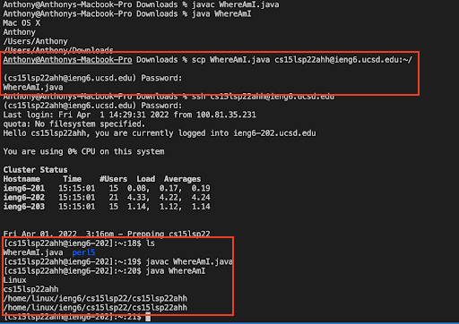

# **Report 1 (Week 1-2) - Remote Access**

<font size= "2">By: Anthony Ton (A16841070)</font>

In this post, you will learn how to remotely access your course-specific account on the `ieng6` server.

## **Part 1** - Setting up VSCode and Running A File
**Step 1:** Download and install [VSCode](https://code.visualstudio.com/download). Make sure to download the correct one for your operating system.

Once you have downloaded VSCode and opened it, it should look something like this.


**Step 2:** Click on the file icon at the top left corner, then click on the file icon with a plus sign next to "OPEN EDITORS".


Copy and paste the following code in after you open a new file:

```
class WhereAmI {
  public static void main(String[] args)
  {
    System.out.println(System.getProperty("os.name"));
    System.out.println(System.getProperty("user.name"));
    System.out.println(System.getProperty("user.home"));
    System.out.println(System.getProperty("user.dir"));
  }
}

```

Then go to `File` at the top left corner and save the file to your computer, name it as `WhereAmI.java`.

**Step 3:** Press CTRL + ` (the key with the "~" symbol) to open the terminal.

In the terminal, run these commands:

`javac WhereAmI.java`

`java WhereAmi`

Then you should see the terminal print out some stuff about your computer and the current directory in your terminal.


## **Part 2** - Remotely Connecting To `ieng6`

**Step 0:** Follow the directions [here](https://docs.microsoft.com/en-us/windows-server/administration/openssh/openssh_install_firstuse) to install OpenSSH<br>
\*\*Do Step 0 if you are using Windows, otherwise skip it\*\*

**Step 1:** Look up your course-specific account [here](https://sdacs.ucsd.edu/~icc/index.php). Under `Account Lookup`, put in your PID (AXXXXXXXX) and username (\<username\>@ucsd.edu) and click submit. 

Under `Additional Accounts`, you will see your course-specific account(s). The account should be the course name, followed by the current quarter, then 3 random letters.

<font size = "1"> _An account for CSE15L in Spring '22_ </font>

**Step 2:** Go back to your terminal in VSCode. In the terminal, type in the following command:

`ssh <account-username>@ieng6.ucsd.edu`

\<account-username\> is the name of your course-specific account that you looked up in the previous step.

Press enter after you enter the command. If it's your first time connecting to the `ieng6` server, the terminal will ask something about the "authenticity of host 'ieng6.ucsd.edu'" and whether you want to continue connecting, enter 'yes' or whatever option they give for continuing.

After typing 'yes', enter your password when the terminal prompts you to. Then you should be logged in.

**Note:** your password will not show up as dots like you would normally see on other websites, so type your password as accurately as you can, then hit 'enter' after you have put in your password.

If you don't know your password, follow this [guide](https://cdn-uploads.piazza.com/paste/ktv2gnof3sx5bf/181c3cb053df5cf1ccaf0457f56f12a2e5aa90b139aef8c2ea8fcc590f02fadf/How-to-Reset-your-Password.pdf) to reset your password.

After logging in, then your terminal will look something like this:


Congratulations, your computer is now connected to one of the computers in the CSE basement!

## **Part 3** - Running Commands
Try running any of the following commands and see what they do (you can run them on your local computer or on the remote computer you accessed):

\*\*To log out of SSH, type `exit`.\*\*

`ls` - lists all of the files and folders in the current directory<br>
`pwd` - prints the current working directory (your absolute path)<br>
`cd` - changes your directory to the specified directory, or your home directory if left blank<br>
`cd ~` - changes your directory to your home directory<br>
`cd ..` -  go up one directory, to the parent directory of the current directory you are in<br>
`cd - ` - brings you to the directory that you were previously in<br>
`cat [file]` - shows you the contents of `[file]`<br>
`rm [file]` - removes `[file]` from your directory. Be careful when using this, there is no way to undo it!<br>
`mkdir [name]` - makes a directory named `[name]`<br>
`cp [file1] [file2]` - copies contents from `[file1]` to `[file2]`. If `[file2]` doesn't exist, it will create a file called `[file2]` then put `[file1]`'s contents in there<br>
`touch [file]` - creates a file called `[file]`


<font size = "1">_Running some of the above commands in the terminal_ </font>

## **Part 4** - Moving Files With `scp`

`scp` stands for Secure Copy. `scp` is a way to securely copy and transfer files between two computers. In this case, from your computer to the computer in the CSE basement, vice versa. The computer that you're typing `scp` on will be the computer with the file that will be copied and transferred; you will specify to which computer you want to transfer the file to in the command-line.

Using the `WhereAmI.java` file we created earlier, we will copy and transfer it to your `ieng6` account.

In general, the `scp` command should follow this format:

`scp <file-name> <account to transfer to>:~/`

Type in the following from your local computer (make sure you log out of `ieng6` first):

`scp HelloWorld.java <account-username>@ieng6.ucsd.edu:~/`

The terminal will prompt you for a password. The password is the same one that you used to log into the `ieng6` server earlier. After entering the password, the file should then be copied and transferred to your account on the `ieng6` server.

Log back into your `ieng6` account and run `ls` to confirm that the file has been successfully transferred. Then run `javac WhereAmI.java` and `java WhereAmI` while logged into the `ieng6` account and check your output. See what's different from when you run it in your computer!

This entire process should look something like this:



Now you have successfully copied and transferred a file over to a remote computer from your own computer!
## **Part 5** - SSH Keygen
Notice that every time you want to `scp` a file or if you are logging into a remote server with `ssh`, the terminal always prompts you for your password. While this adds an extra layer of security for you, at the same time, it can be a very repetitive and time-consuming process. Imagine if you have to switch back and forth between your local computer and the remote computer while working and you are prompted for your password everytime! Wouldn't it be annoying?

To get around this issue, we use something called `ssh` keys. Using `ssh-keygen`, we create a pair of public and private keys. The private key goes into the client computer, your computer in this case, and the public key goes into the remote computer that you will be accessing. The `ssh` command will then use these two keys in place of your password! So if your computer and the remote computer you're connecting to have the keys, then you will automatically log in whenever you use `ssh` without being prompted for your password.

Do the following to set this up:

**On your computer:**

Type in `ssh-keygen`

The terminal will then say `"Generating public/private rsa key pair."`, then:

 `Enter file in which to save the key (/Users/<user-name>/.ssh/id_rsa): /Users/<user-name>/.ssh/id_rsa`

 Type in the file directory as exactly as they give, while replacing  `<user-name>` with your corresponding `<user-name>` on your computer. If unsure, run `pwd`, whatever comes right after `/Users/` is your `<user-name>`.

 The terminal will then ask for a passphrase, do not put anything in and just hit enter. The terminal will ask you to put the passphrase again, and just hit enter again.

 Afterwards, the terminal should say something like this:

 `Your identification has been saved in /Users/<user-name>/.ssh/id_rsa.` 

 `Your public key has been saved in /Users/<user-name>/.ssh/id_rsa.pub.`

`The key fingerprint is:
SHA256:jZaZH6fI8E2I1D35hnvGeBePQ4ELOf2Ge+G0XknoXp0 <user-name>@<system>.local`

There will also be a randomart image of the key that is generated, you can safely ignore it.

The file `id_rsa` is your private key, and the file `id_rsa.pub` is your public key.

Now, we need to copy the public key file to the `.ssh` directory on your remote computer.

Log in to your `ssh` account. Once logged on, run `mkdir .ssh`, which will create a directory named `.ssh` on your remote computer, then log out.

Back on your computer, run:

`scp /Users/<user-name>/.ssh/id_rsa.pub <account-username>@ieng6.ucsd.edu:~/.ssh/authorized_keys`

This command will copy and transfer the public key on your computer into a file called `authorized_keys` inside the `.ssh` directory in your remote computer. 

After finishing this part, you should now be able to to run `scp` and `ssh` without a password. Try it out! It should look like this:


## **Part 6** - Optimizing Remote Running

To make remote accessing even easier, there are many things that you can do:
* You can call a command inside quotes after the `ssh` command, which will run that command on the remote computer. For example:

    * Running `ssh cs15lsp22ahh@ieng6.ucsd.edu "pwd"` will log you into the remote computer, run the `pwd` command, which lists your absolute path, and then exit. Try it out for yourself with other commands!
* You can call multiple commands on one line by using `;` to separate commands. For example:
    * Running `pwd; javac WhereAmI.java; java WhereAmI` will list your current absolute path, compile `WhereAmI.java`, and run `WhereAmI.java`.
* You can also use the up- and down-arrow keys to navigate between the commands you have used in the past.

The following screenshot shows you a possible way to `scp` a file to your remote computer, compile and then run it on the remote computer!


Try out these shortcuts and find other ways in which you can further optimize your remote accessing experience!

### **Sources**:
* [Week 1 Lecture](https://docs.google.com/presentation/d/1M1usJWoXlajH29ONzpQ7L2BxeHMdL3C7sMUSBtogpOw/edit#slide=id.g120e3f4dfe5_0_1255)
* [Lab 1 Write-Up](https://docs.google.com/document/d/1AO6RDoJnaWxMui-UFjEa_2bbQ4qcANpbIpPuV-awsOg/edit)
