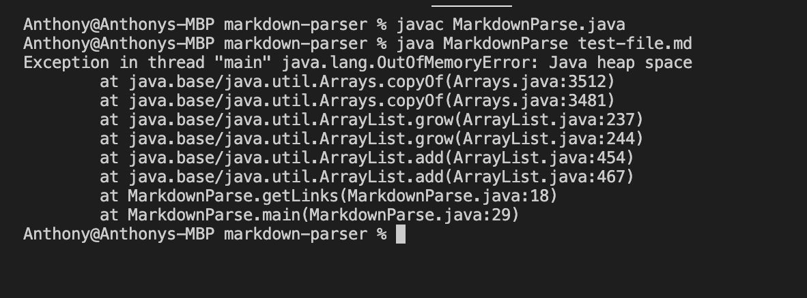
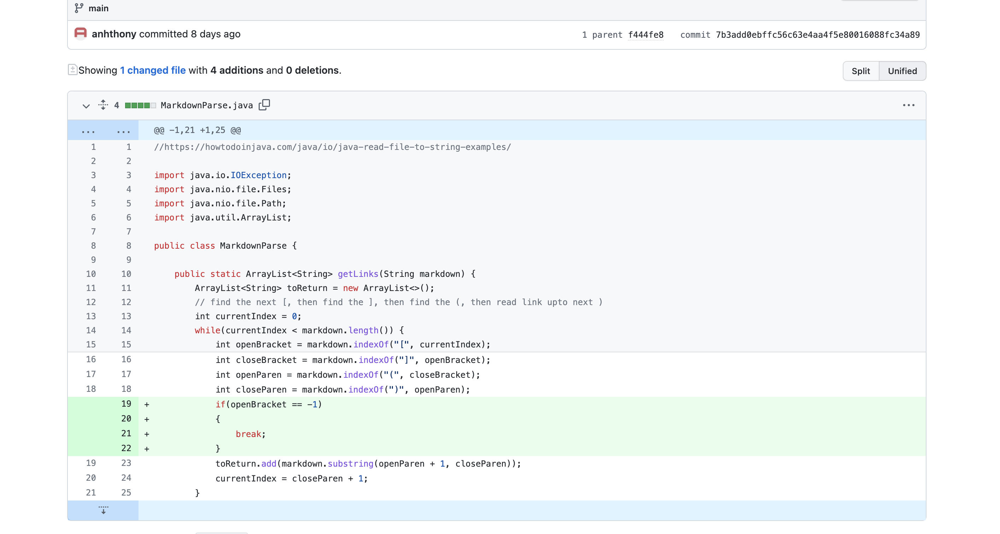
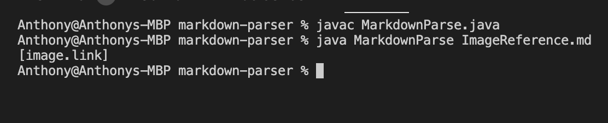
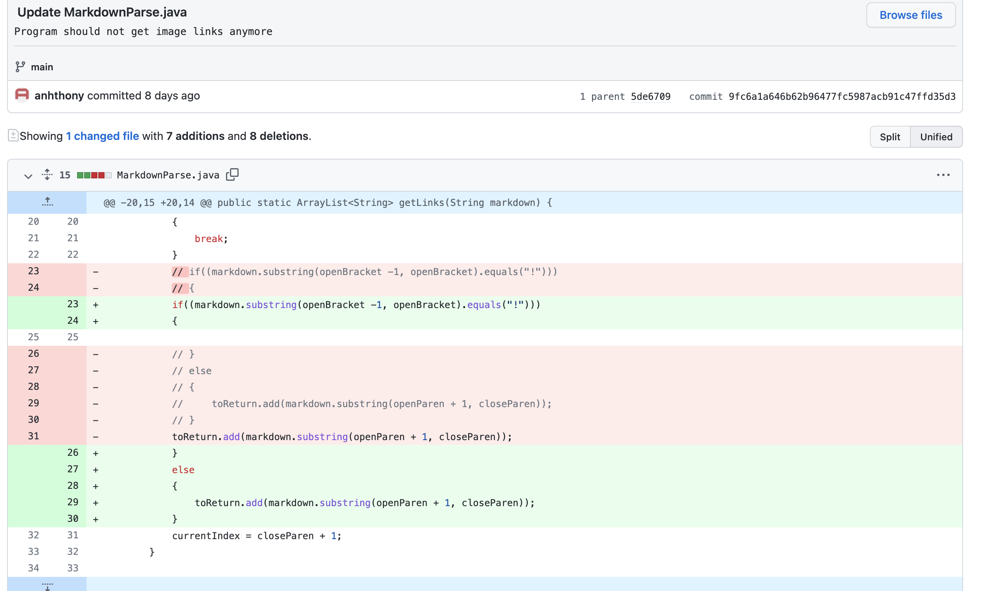
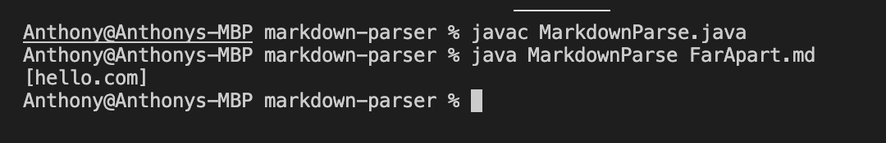
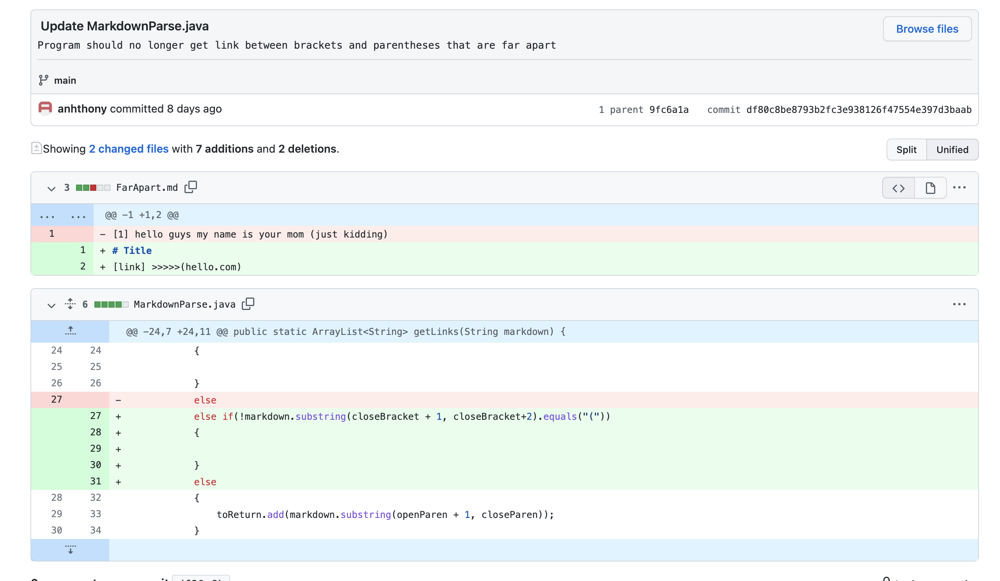

# **Report 2 (Week 3-4) - Debugging**

<font size= "2">By: Anthony Ton (A16841070)</font>

In this post, I will be going over the 3 code changes that me and my partner made to the ```MarkdownParse``` program that we were given in our lab on week 3.

```MarkdownParse``` is a program that parses throught a ```.md``` file and returns all of the links contained in that file. Per the formatting of Markdown, links are usually shown in the format ```[<text>](<link>)```, so the program will look for all instances of this specific formatting in a ```.md``` file and return all of the links in that file.

For example, given a ```.md``` file like this:
```
# This is an example

[Link1](abc.com)
hi hello
[Link2](def.com)
```
The program would return ```[abc.com, def.com]``` when that ```.md``` file is given to the program.

## **Code Change #1**

For our first code change, the [```test-file.md```](https://anhthony.github.io/cse15l-lab-reports/report2/test-file.md) file was a failure-inducing input for the program. Here are the contents of the file:
```
# Title

[link1](https://something.com)
[link2](some-thing.html)

```

\*\* Notice that there is a new line after the second link

When running the program on that file, this was the output:


Me and my partner weren't sure what to make of the ```OutOfMemoryError``` message, so we put in a ```System.out.println("hello")``` to see what the program was doing, and when we recompile and ran the program, it resulted in the program continuously printing "hello", as shown below.

[](https://gyazo.com/46275add82bfe5eef688308e0e0de578)

To fix this problem, my partner and I made the following change to the program:



This change essentially checks if an index for ```[``` exists, and if it does not (the index being -1), we stop the loop.

What happened before the code change was that the ```.md``` file that we were using as our test file had a new line after the second link. That new line, and any characters after the last link, were our failure-inducing input. The code for the program searches for a ```'[', ']', '(' and ')' ``` to find the links using a while loop, and the loop only stops when the search index that is used on the string that contains the raw ```.md``` file is equal to the string's length. However, the index's update is dependent on the index of the latest ```)```. After getting the last link, the search index would be set to 0 on the next loop because ```indexOf(")")``` would return -1, which cause the loop to be never-ending. Our bug was that we did not account for non-link-related characters that would come after the last link, and that caused the symptom of the program being stuck in an infinite loop.

## **Code Change #2**

For our second code change, the [```ImageReference.md```](https://anhthony.github.io/cse15l-lab-reports/report2/ImageReference.md) file was a failure-inducing input for the program. Here are the contents of the file:
```

```

When running the program on that file, we got:


```MarkdownParse``` is only supposed to return links, not image links, so this was clearly a symptom of a bug in the program. We noticed that the formatting for images and links in Markdown are very similar, with image being ``````, while link being ```[<text>](<link>)```.

To fix this problem of our program capturing image links, we made the following changes:



Because the difference in formatting between an image and a link in Markdown is just a ```!```, our change was adding in the following if statement:

 ``` 
 if((markdown.substring(openBracket -1, openBracket).equals("!")))
 {

 }
 else
 {
     toReturn.add(markdown.substring(openParen + 1, closeParen));
 }
 ``` 
 
 The if statement checks that the formatting is of a link before adding in the link into the ArrayList that stores the links. If the formatting has ```!``` before the ```[```, then the link will not be added. Otherwise, the link will be added.

Before this code change, the failure-inducing input was a Markdown formatting for images that is very similar to the formatting for links. The bug was that we didn't account for this situation and the program was storing links as long as the ```[<text>](<link>)``` format was satisfied. This resulted in a symptom of the program outputting images' links along normal links when it is only supposed to be outputting normal links.

## **Code Change #3**
For our third code change, the [```FarApart.md```](https://anhthony.github.io/cse15l-lab-reports/report2/FarApart.md) file was a failure-inducing input for the program. Here is the contents of the file:
```
# Title
[link] >>>>>(hello.com)
```

When running the program on that file, we got:



As you can see in the contents of ```FarApart.md```, there is no Markdown formatting for a link. The ```[link] >>>>>(hello.com)``` in this case is just normal text that happens to contain brackets and parentheses. However, the program doesn't recognize this and thought because there exist a ```'[', ']', '('``` and ```')'```, then that means there is a link in between the ```'(' and ')'```, and so the program returns whatever is in between the parentheses when it is not supposed to. 

To fix this problem, we added in the following changes:



We added in an else-if clause that follows the if clause from code change #2:
```
 else if(!markdown.substring(closeBracket + 1, closeBracket+2).equals("("))
 {

 }
 ```

 This else-if statements basically checks whether there is a ```'('``` that comes right after the ```']'```, which follows the Markdown link formatting of ```[<text>](<link>)```. If there is no ```'('``` right after the ```']'```, then it means that the brackets and parentheses are not a Markdown link formatting, so whatever is in between the parentheses won't be added. If there is a ```'('``` right after a ```']'```, then it is a Markdown link formatting and the link in between the parentheses will be added.

 Before this code change, the failure-inducing input was a ```.md``` file that had ```'[', ']', '(' and ')'``` that weren't in Markdown link formatting and the program was returning the stuff in between the parentheses. The bug was that the program wasn't able to tell whether ```'[', ']', '(' and ')'``` constituted a Markdown link formatting or not. As a result, the program had a symptom of outputting the stuff between the parentheses because it wasn't able to tell if the ```'[', ']', '(' and ')'``` was an actual Markdown link formatting or not.

### **Sources**:
* [Lab 3 Write-Up](https://docs.google.com/document/d/1LnSfvTG_Hn2fxDtFMuhBhJqsf9336Bm1ljux2Af9FqE/edit#)
* [Lab 3 Notes](https://docs.google.com/document/d/1j7j3V9y_np-_PW8wiLxfTX3LOZkv8d4R3hcUWgQe-zQ/edit?usp=sharing)
