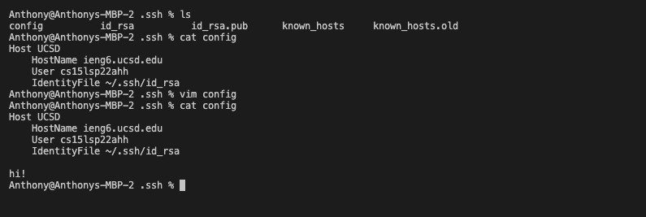

# **Report 3 (Week 5-6) - Remote Access**

<font size= "2">By: Anthony Ton (A16841070)</font>

In this post, I will be documenting my implementations of all of the group choices that me and my group were given in the [lab 5 write up](https://docs.google.com/document/d/1NQ17hecUPFKeoFyrEvK9DBlCS1JkDbMW6Ygrf_CJJJU/edit).

## Choice #1 - Streamlining ```ssh``` Configuration

Choice #1 is about making using ```ssh``` even easier than what we did before (creating ```ssh``` keys). What we did in this choice is creating a ```config``` file in the ```.ssh``` directory that stores the host's name, the username to use to log into that host, and the private ```ssh``` key of our computer. In the file, we also provided an "alias" of the host to make it easier to type in the terminal when using ```ssh```. Here is my ```config``` file, which I created using ```touch``` and edited using ```vim```:

|  |
|:--:|
| <b>Notice the "hi!" that I added using ```vim```!</b>|

In the ```config``` file, the alias that I mentioned earlier is what comes after ```Host``` in the file, so in this case, the alias is ```UCSD```. You can use the alias instead of your account username when using ```ssh``` to log into your remote computer. So if I do ```ssh UCSD```, I would be able to log in! Take a look below:


And we are in!

You can also use that same alias for when you try to ```scp``` a file from your local computer to the remote computer. Below is an example of so:


Here I used the alias in place of the account of the remote server to ```scp example.txt```, and it worked!

## Choice #2 - Setup GitHub Access From ```ieng6```

When using ```git``` commands in the terminal, ```git push``` doesn't really work when you try to push your commits to the remote repository. This is because GitHub doesn't really know who you (the computer) are when you are trying to push your commits. To resolve this, GitHub uses ```ssh``` keys for identification. To let GitHub know you who are, simply add the public ```ssh``` key of the computer you're running ```git push``` on to your GitHub account. For this post, I will be showing you how I did the GitHub access set up from my ```ieng6``` account.

On my ```ieng6``` account, since I never had ```ssh``` keys on there, I ran ```ssh-keygen``` to create my public and private keys, named ```id_rsa.pub``` and ```id_rsa```, respectively. Both keys are stored in the ```.ssh``` directory by default. Here is a picture of my public key's contents and where my private key is stored:

|  |
|:--:|
| <b>My public key's location and contents.</b>|


|  |
|:--:|
| <b>My private key's location</b>|


Then I copied the contents of my public key, go on GitHub, go to my account's settings, and on "SSH and GPG Keys", selected "New SSH Key", give it a title, pasted in the contents of the public key I copied from the terminal, and created a new key for my GitHub account. Here is a picture of my public key on GitHub: 


Now, in my ```ieng6``` account, I have a directory called ```SkillDemo1```, which is a GitHub repository I used for my Week 5 Skill Demonstration Video. I'm going to create an empty file called ```example2.txt``` in that repository using ```touch```, then I will do ```git add <file-name>```, ```git commit -m "<message>"``` and ```git push``` to update my remote ```SkillDemo1``` repository. Here is what it looks like:


After I have done that, then on the GitHub webpage, I should see the changes that I have made.


Here is a link to the commit that I made in the terminal: [https://github.com/anhthony/SkillDemo1/commit/f1cd800b3344bfa1d5a43faba9a08d1400cc287a](https://github.com/anhthony/SkillDemo1/commit/f1cd800b3344bfa1d5a43faba9a08d1400cc287a)

## Choice #3 - Copy Whole Directories With ```scp -r```

The ```scp``` command is a great command for copying a file from one computer to another on a different computer. But what if you want to copy an entire directory with dozens of files in them? Granted you could probably run ```scp``` on each of the file in that directory, but that would be too tiring and time-consuming. Instead, we can use ```scp -r``` to do that. ```scp -r``` copies recursively, so it will copy all of the files in your current directory, and any files/directories within each of those files, and further down if it has to do so! To use ```scp -r```, simply do ```scp -r . <remote-account>:~/<directory-to-copy-to>```. The ```.``` is the source to copy or the current directory that you are in. ```<remote-account>``` is the remote computer that you will be ```scp```'ing to, and the ```<directory-to-copy-to>``` is the directory where everything will go to in the remote computer. If that directory doesn't exist, a directory named so will be created for you.

I will demonstrate using ```scp -r``` on my ```markdown-parser``` directory by ```scp```'ing it to my ```ieng6``` account and compiling and running my test file on the ```ieng6``` account in the picture below:

| [](https://gyazo.com/d30e73e04ba097e3896ee293a2f454a0) |
|:--:|
| <b>```scp```'ing ```markdown-parser``` to my ```ieng6``` account</b>|

|  |
|:--:|
| <b>Compiling and running the test file, ```MarkdownParseTest.java```.</b>|

To make this entire process of ```scp```'ing, then logging into ```ssh``` and running the test file even faster, I can do it in one command line by using ```;```. My command line would then look like this: 
```
scp -r . ieng6:~/markdown-parser; ssh ieng6 "cd markdown-parser; /software/CSE/oracle-java-17/jdk-17.0.1/bin/javac -cp .:lib/junit-4.13.2.jar:lib/hamcrest-core-1.3.jar MarkdownParseTest.java; /software/CSE/oracle-java-17/jdk-17.0.1/bin/java -cp .:lib/junit-4.13.2.jar:lib/hamcrest-core-1.3.jar org.junit.runner.JUnitCore MarkdownParseTest"
```

Note: I'm using ```/software/CSE/oracle-java-17/jdk-17.0.1/bin/javac``` instead of ```javac``` and 
```/software/CSE/oracle-java-17/jdk-17.0.1/bin/java``` instead of java because of the issue detailed [here](https://piazza.com/class/l0lgl3r7ph370k?cid=444).

So if I run my one-line command, it would look like this:

[](https://gyazo.com/c1cd535732df09d9d84c4492701a1630)

### Sources
* [Lab 5 Write-Up](https://docs.google.com/document/d/1NQ17hecUPFKeoFyrEvK9DBlCS1JkDbMW6Ygrf_CJJJU/edit?usp=sharing)
* [@444 on Piazza](https://piazza.com/class/l0lgl3r7ph370k?cid=444)