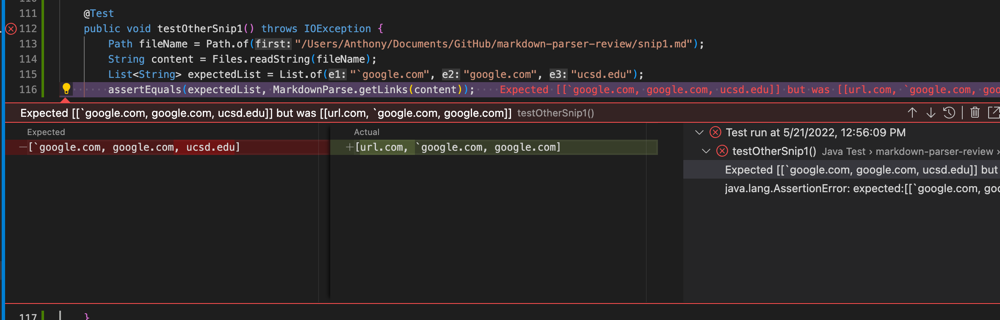
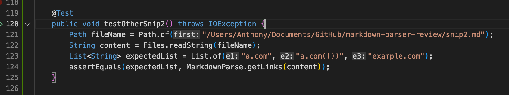
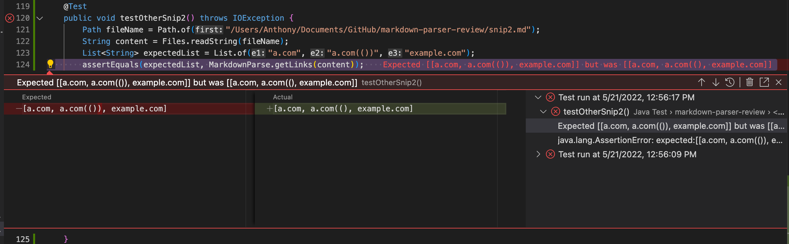
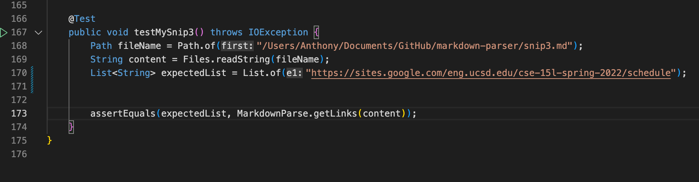
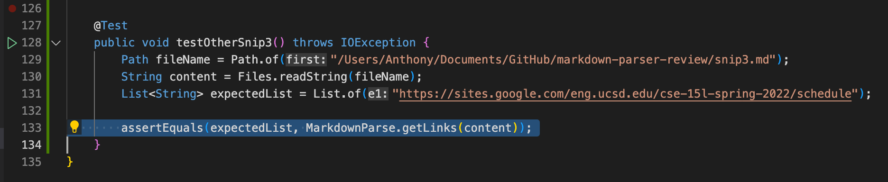
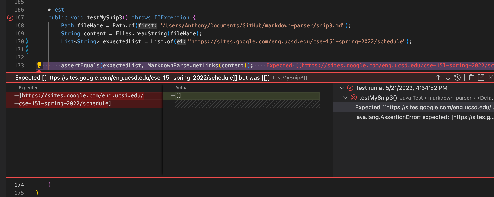
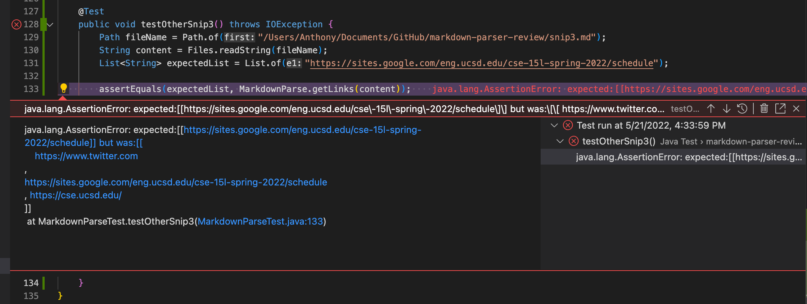

# **Report 4 (Week 7-8)**

<font size= "2">By: Anthony Ton (A16841070)</font>

In this post, I will be testing three given markdown snippets on my group's implementation of `markdown-parse` and another group's implementation of `markdown-parse` that me and my group reviewed in week 7.

My group's implementation: [https://github.com/anhthony/markdown-parser](https://github.com/anhthony/markdown-parser)

The group we reviewed's implementation: [https://github.com/richmass1/markdown-parser](https://github.com/richmass1/markdown-parser)

## **Markdown Snippet #1** ##
Below is the first markdown snippet.
```
`[a link`](url.com)

[another link](`google.com)`

[`cod[e`](google.com)

[`code]`](ucsd.edu)
```


From VSCode's markdown preview, the expected output of `markdown-parse` when given this markdown snippet should be ```[`google.com, google.com, ucsd.edu]```, as you can see below.


On both my group's and the other group's implementation, I turned this markdown snippet into a JUnit test.

The test in my group's implementation:


The test in the other group's implementation:


### **Result of The Test** ###
After implementing a JUnit test on markdown snippet #1 on both my group's and the other group's implementation, I ran the test on both implementations and the test failed on both implementations. You can see below the expected vs. actual output of the test on both implementations.

Result of my group's implementation:


Result of the other group's implementation:


For my group's implementation, we got ```[url.com, `google.com, google.com]``` as the output, which differs from the output that I expected.

The other group's implementation also got the same output as my group's, ```[url.com, `google.com, google.com]```, which, again, differs from the output that I expected.

I believe that a small code change of less than 10 lines can make my group's program work and produce the expected output for markdown snippet #1 and all related cases that use inline code with backticks. The code change would involve checking the start and end of the backticks and disregard any `[, ], (` and `)` inside the backticks. This would essentially ignore all markdown link formatting brackets and parentheses inside the backticks so that it does not interfere with the way my program checks for markdown link formatting.

## **Markdown Snippet #2** ##
Below is the second markdown snippet.
```
[a [nested link](a.com)](b.com)

[a nested parenthesized url](a.com(()))

[some escaped \[ brackets \]](example.com)
```


From VSCode's markdown preview, the expected output of `markdown-parse` when given this markdown snippet should be `[a.com, a.com(()), example.com]`, as you can see below.


On both my group's and the other group's implementation, I turned this markdown snippet into a JUnit test.

The test in my group's implementation:


The test in the other group's implementation:


### **Result of The Test** ###
After implementing a JUnit test on markdown snippet #2 on both my group's and the other group's implementation, I ran the test on both implementations and the test failed on both implementations. You can see below the expected vs. actual output of the test on both implementations.

Result of my group's implementation:


Result of the other group's implementation:


For my group's implementation, we got `[]` as the output, which differs from the output that I expected.

The other group's implementation's output was`[a.com, a.com((), example.com]`, which differs from the expected output by just one `)` in `a.com(())`.

I don't think a small code change of less than 10 lines would make my group's program work for markdown snippet #2 and all related cases that nest parentheses, brackets, and escaped brackets. This is because our program works by identifying whether or not the markdown link formatting brackets and parentheses (`[, ], (` and `)`) are in order. If they are in order, then it is considered a link and it would return whatever is in between `(` and `)`. Because this type of link formatting is something that we never took into account, I believe a whole revamp of our code is necessary to address these types of link formatting, therefore a small code change of less than 10 changes would not be enough to address this case of link formatting.

## **Markdown Snippet #3** ##
Below is the third markdown snippet.
```
[this title text is really long and takes up more than 
one line

and has some line breaks](
    https://www.twitter.com
)

[this title text is really long and takes up more than 
one line](
https://sites.google.com/eng.ucsd.edu/cse-15l-spring-2022/schedule
)


[this link doesn't have a closing parenthesis](github.com

And there's still some more text after that.

[this link doesn't have a closing parenthesis for a while](https://cse.ucsd.edu/


)

And then there's more text
```


From VSCode's markdown preview, the expected output of `markdown-parse` when given this markdown snippet should be `[https://www.twitter.com, https://sites.google.com/eng.ucsd.edu/cse-15l-spring-2022/schedule, https://cse.ucsd.edu/]`, as you can see below.


On both my group's and the other group's implementation, I turned this markdown snippet into a JUnit test.

The test in my group's implementation:


The test in the other group's implementation:


### **Result of The Test** ###
After implementing a JUnit test on markdown snippet #2 on both my group's and the other group's implementation, I ran the test on both implementations and the test failed on both implementations. You can see below the expected vs. actual output of the test on both implementations.

Result of my group's implementation:


Result of the other group's implementation:


For my group's implementation, we got `[]` as the output, which differs from the output that I expected.

The other group's implementation's output was `[ https://www.twitter.com
, 
https://sites.google.com/eng.ucsd.edu/cse-15l-spring-2022/schedule
, https://cse.ucsd.edu/]`, which is almost exactly like what the expected output was except for the whitespaces.

I don't think a small code change of less than 10 lines would make my group's program work for markdown snippet #3 and all related cases that have newlines in brackets and parentheses. This is because our program does not take into account new lines inside a markdown link formatting, therefore it is not able to recognize a valid markdown link formatting that spans across multiple lines. To fix this case of markdown link formatting, I believe a small code change of less than 10 lines would not be enough, and a whole revamp of the code would be needed instead.

### Sources
N/A