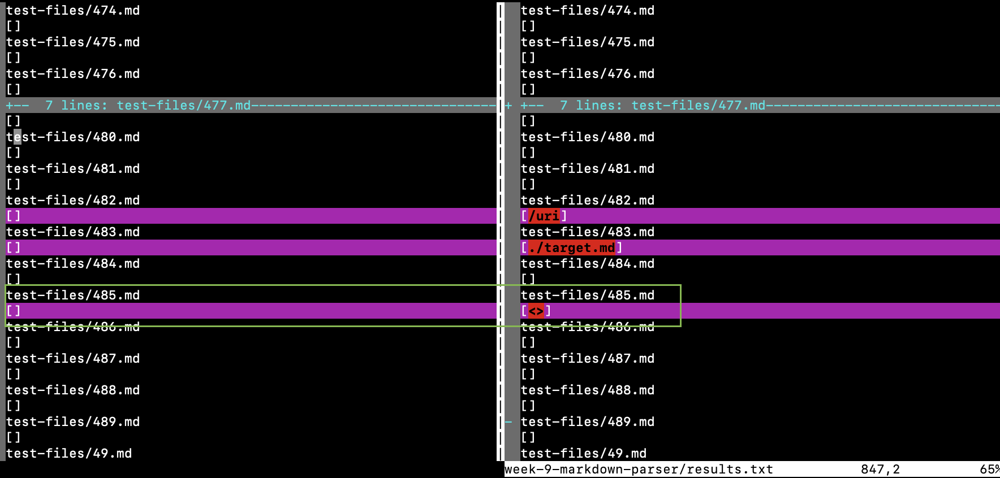
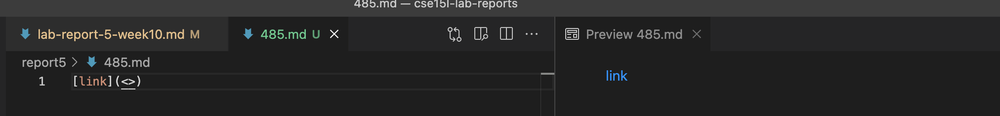
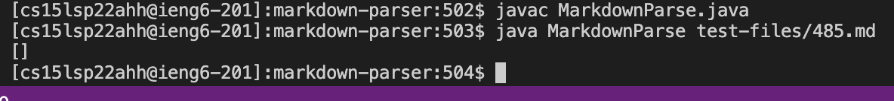
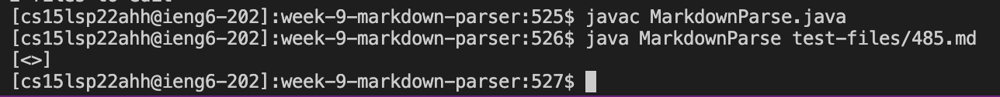
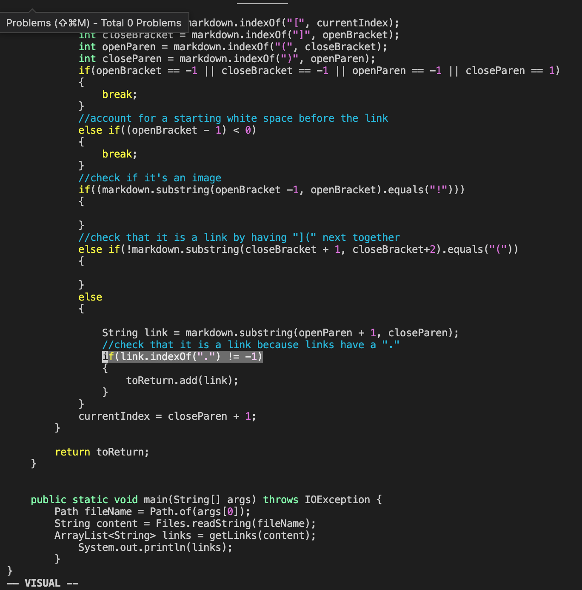

# **Report 5 (Week 9-10)**

By: Anthony Ton (A16841070)

Two tests where my group's implementation provided different answers than the provided implementation for lab 9: `201.md` and `485.md`

I found these tests by using `vimdiff` on the `results.txt` file that I generated on my group's implementation and the provided implementation. After running `vimdiff ~/markdown-parser/results.txt ~/week-9-markdown-parser/results.txt`, I was able to look at and compare the differences in output between the two implementations on all of the test files in `test-files/`, like seen in the two pictures below.. Then I picked two random tests, which are `201.md` and `485.md`. 

|  |
|:--:|
| <b>Difference in output of `201.md` when ran using my group's implementation (left) and the provided implementation (right)</b>|

|  |
|:--:|
|<b> Difference in output of `485.md` when ran using my group's implementation (left) and the provided implementation (right)</b>|

Link to `201.md`: [https://github.com/nidhidhamnani/markdown-parser/blob/main/test-files/201.md?plain=1](https://github.com/nidhidhamnani/markdown-parser/blob/main/test-files/201.md?plain=1)

Link to `485.md`: [https://github.com/nidhidhamnani/markdown-parser/blob/main/test-files/485.md?plain=1](https://github.com/nidhidhamnani/markdown-parser/blob/main/test-files/485.md?plain=1)

## **Test File `201.md`** ##

### **Expected Output:** ###
By using VSCode Preview on the test file, the expected output when running `MarkdownParse` on `201.md` is `[]`, meaning that there should be no links in `201.md`. The below picture shows the expected output of the test using VSCode Preview.

|  |
|:--:|
|<b>Expected output of `MarkdownParse` when ran on `201.md` using VSCode Preview</b>

### **My Group's Implementation's Output:** ###

When running my group's implementation on `201.md`, we got `[]`, as you can see in the picture below.

|  |
|:--:|
|<b>Output of my group's implementation when running it in on `201.md`</b>|

### **Provided Implementation's Output:** ###

When running the provided implementation on `201.md`, we got `[baz]`, as you can see in the picture below.

|  |
|:--:|
|<b>Output of the provided implementation when running it on `201.md`</b>|

Based on the expected output from VSCode Preview, my group's implementation for `201.md` is correct, while the provided implementation is incorrect.

I believe the bug in the provided implementation is that it does not check whether the `]` and `(` are next to each other when it finds all 4 of `[, ], (,` and `)`. If the `]` and `(` are not next to each other, then it does not constitute a markdown link formatting. In the following picture of the code, the highlighted part is where the code change should be put in. The change should be about checking whether `]` comes right before `(`, (i.e the formatting should look like `"...](..."`) before adding the link into the ArrayList.

|  |
|:--:|
|<b>The highlighted part is where the code change should be for the provided implementation </b>|

## **Test File `485.md`** ##

### **Expected Output** ###
By using VSCode Preview on the test file, the expected output when running `MarkdownParse` on `485.md` is `[<>]`, meaning that there is a link called `<>` in `485.md`. The below picture shows the expected output of the test using VSCode Preview.

|  |
|:--:|
|<b> Expected output of `MarkdownParse` when ran on `485.md` using VSCode Preview. </b>|

### **My Group's Implementation's Output:** ###

When running my group's implementation on `485.md`, we got `[]`, as you can see in the picture below.

|  |
|:--:|
|<b>Output of my group's implementation when running it in on `485.md`</b>|

### **Provided Implementation's Output:** ###

When running the provided implementation on `485.md`, we got `[<>]`, as you can see in the picture below.

|  |
|:--:|
|<b>Output of the provided implementation when running it on `485.md`</b>|

Based on the expected output from VSCode Preview, the provided implementation for `485.md` is correct, while my group's implementation is incorrect.

I believe the bug in my group's implementation is that for every potential link that we add in, we check to see if whether the link has a `.` in it, because all valid links have a `.` in it. So a fix for our implementation would just be removing the statement that checks for the `.` in potential links. So in the implementation below, I would just need to remove the highlighted `if` statement and its condition, and keep its body.

|  |
|:--:|
|<b> The highlighted part is where the code change should be for my group's implementation</b>|

However though, I believe my group's implementation is still technically correct, since `<>` is not a valid URL. But in this case, since VSCode Preview shows that `<>` is a link, then my group's implementation is wrong in this sense.

### Sources
* [Provided implementation](https://github.com/nidhidhamnani/markdown-parser)
* [`201.md`](https://github.com/nidhidhamnani/markdown-parser/blob/main/test-files/201.md?plain=1)
* [`485.md`](https://github.com/nidhidhamnani/markdown-parser/blob/main/test-files/485.md?plain=1)